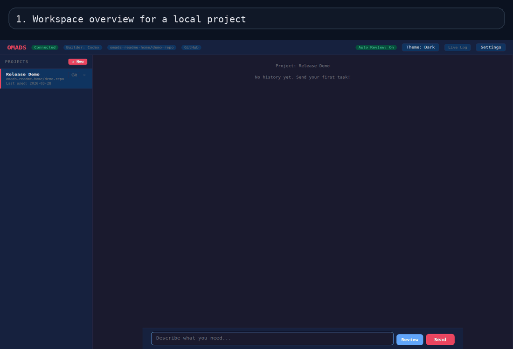
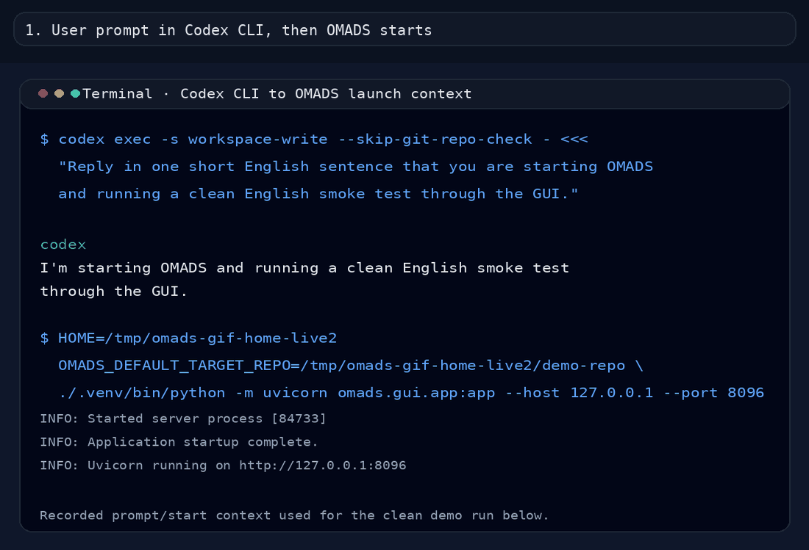

# OMADS — Orchestrated Multi-Agent Development System

OMADS is a local web workspace for people who want to build with one coding agent and immediately cross-check the result with another one.

- Choose **Claude Code** or **Codex** as the primary builder
- Let OMADS run an automatic **builder -> breaker** loop after code changes
- Trigger a separate **manual three-step review** when you want a deliberate deep check
- Keep chat activity, review output, and the live log visible after reloads through one shared timeline

No API keys are required. OMADS works with the CLIs you already use, such as Claude Code and Codex, and reuses their existing subscriptions.

  



A short tour of the current OMADS interface: workspace, project settings, manual review configuration, review dialog, and built-in diff viewer.

## Why OMADS

Most local AI coding workflows break down in one of two ways:

- you only get one agent's opinion on a change
- you lose important runtime context once the terminal scrolls away or the UI reloads

OMADS is built to solve both.

The normal coding loop is:

1. Pick your primary builder
2. Send a coding task in the chat
3. Let the builder work in the repository
4. If files changed, let the breaker challenge the result
5. Send the findings back to the builder for the final decision

The **Review** button is intentionally separate. It exists for manual inspections of an existing local project, a specific path, or a deliberate full-project review outside the normal coding loop.

## What You Can Do With OMADS

- Switch the primary builder between Claude Code and Codex — conversation context is handed over automatically so the new builder can continue where the other left off
- Run the automatic breaker loop after builder-created code changes
- Configure the manual review pipeline as `Claude -> Codex -> Claude` or `Codex -> Claude -> Codex`
- Review the whole project, only the last task, or a custom file/folder selection
- Add custom free-text review instructions instead of relying only on fixed presets
- Inspect the current Git working tree through the built-in diff viewer
- Keep live activity visible in both the chat surface and the live log after reloads
- Work across multiple local projects from one GUI

## Quick Start

```bash
git clone https://github.com/<your-username>/omads.git
cd omads
python3 -m venv .venv
source .venv/bin/activate
pip install -e .
./start-omads.sh
```

Then open `http://localhost:8080`.

If you want the full install guide for Windows, macOS, Linux, Docker, and headless starts, keep reading below.

## Repository Guide

If multiple agents or developers work on the same repository state, these are the main entry points:

- `README.md` — onboarding, installation, and product overview
- `BACKLOG.md` — active priorities and next tasks
- `CHANGELOG.md` — notable shipped changes
- `docs/architecture.md` — current architecture and module boundaries
- `AGENTS.md` — binding workflow rules for coding agents
- `PROJECT_RULES.md` — repository-specific collaboration rules
- `CONTRIBUTING.md` — contributor workflow and validation expectations

---

## Backend Structure

The old GUI backend monolith has been split into focused modules:

- `src/omads/gui/server.py` — stable compatibility facade
- `src/omads/gui/app.py` — FastAPI app, middleware, and router wiring
- `src/omads/gui/routes.py` — REST endpoints
- `src/omads/gui/websocket.py` — WebSocket endpoint and GUI command handling
- `src/omads/gui/state.py` — persistent settings, project registry, GUI status, logs, chat sessions, project memory
- `src/omads/gui/runtime.py` — runtime state, broadcasts, task routing, and high-level orchestration
- `src/omads/gui/builder_flow.py` — Claude/Codex builder runs plus the automatic breaker follow-up paths
- `src/omads/gui/review_flow.py` — manual review helpers plus Claude/Codex review/synthesis subprocess steps
- `src/omads/gui/static/js/` — browser-side modules for chat/log rendering, settings/diff UI, project/history loading, and app bootstrapping
- `src/omads/gui/launcher.py` — local startup via Uvicorn and browser opening

Functional changes should usually happen in the appropriate module instead of the facade in `server.py`.

---

## Tests

Run the smoke-test suite with `pytest`:

```bash
pip install -e ".[dev]"
pytest
```

For the browser-based E2E suite, install Chromium once:

```bash
python -m playwright install chromium
```

The current tests cover server startup, security headers, settings and project validation, runtime status refresh, health/status/ledger endpoints, diff and OpenAPI routes, WebSocket guardrails, log filtering, chat-session persistence, builder selection, configurable review routing, mocked Claude/Codex review-fix handoff paths, and real browser E2E flows for theme switching, builder switching, the diff viewer, and the WebSocket chat UI without requiring live Claude/Codex quota.

The GUI now restores the chat and live log from one shared per-project event timeline, and it loads that timeline in bounded pages so long histories stay responsive without truncating the underlying data.

### Live Claude Builder Smoke Test

Use the live Claude builder smoke test before documenting or publishing behavior that depends on the running GUI, the WebSocket chat path, and the real Claude Code CLI integration.



This animation starts with the recorded Codex CLI launch context and then switches to the real OMADS GUI for the live English smoke-test run.

The full procedure and the verified March 28, 2026 results live in [docs/live-smoke-tests.md](docs/live-smoke-tests.md).

---

## Requirements

| Tool | Minimum version | Purpose |
|------|-----------------|---------|
| **Python** | 3.11+ | OMADS backend |
| **Node.js** | 18+ for Claude Code, 22+ for Codex | CLI tools |
| **npm** | bundled with Node.js | CLI installation |
| **Claude Code CLI** | current | Selectable builder agent and reviewer |
| **Codex CLI** | current | Selectable builder agent and reviewer |

### Subscription Requirements

OMADS does **not** rely on API keys. Both CLIs authenticate through your existing subscriptions:

- **Claude Code CLI** → [Claude Pro, Max, or Team](https://claude.ai)
- **Codex CLI** → [ChatGPT Plus or Pro](https://chatgpt.com)

---

## Installation

### 1. Install Python

<details>
<summary><strong>Windows</strong></summary>

Download Python 3.11+ from [python.org](https://www.python.org/downloads/).

Make sure to enable **Add Python to PATH** during installation.

```powershell
python --version   # Should show 3.11+
```
</details>

<details>
<summary><strong>macOS</strong></summary>

```bash
brew install python@3.12
```
</details>

<details>
<summary><strong>Linux</strong></summary>

```bash
# Ubuntu / Debian / Linux Mint
sudo apt update && sudo apt install python3.12 python3.12-venv python3-pip

# Fedora
sudo dnf install python3.12

# Arch
sudo pacman -S python
```
</details>

### 2. Install Node.js

<details>
<summary><strong>Windows</strong></summary>

Download Node.js 22+ (LTS) from [nodejs.org](https://nodejs.org/).

```powershell
node --version   # Should show v22+
npm --version
```
</details>

<details>
<summary><strong>macOS</strong></summary>

```bash
brew install node@22
```
</details>

<details>
<summary><strong>Linux</strong></summary>

```bash
# Ubuntu / Debian / Linux Mint (via NodeSource)
curl -fsSL https://deb.nodesource.com/setup_22.x | sudo -E bash -
sudo apt install -y nodejs

# Or via nvm
curl -o- https://raw.githubusercontent.com/nvm-sh/nvm/v0.40.3/install.sh | bash
source ~/.bashrc
nvm install 22
nvm use 22
```
</details>

### 3. Install Claude Code CLI

```bash
npm install -g @anthropic-ai/claude-code
```

For first-time login, run:

```bash
claude
```

This opens a browser window for authentication.

### 4. Install Codex CLI (optional)

```bash
npm install -g @openai/codex
```

For first-time login, run:

```bash
codex
```

If Codex is not installed, OMADS still works for Claude-only builder usage, but Claude-built changes cannot use the automatic breaker step and Codex cannot be selected as builder or reviewer.

### 5. Clone and set up OMADS

```bash
git clone https://github.com/<your-username>/omads.git
cd omads

python3 -m venv .venv

# Linux / macOS
source .venv/bin/activate

# Windows PowerShell
.venv\Scripts\Activate.ps1

# Windows CMD
.venv\Scripts\activate.bat

pip install -e .
```

### 6. Start OMADS

The easiest local start on Linux or macOS is:

```bash
./start-omads.sh
```

This helper script creates `.venv` if needed, installs OMADS into it, and launches the GUI.

On Windows PowerShell, use:

```powershell
.\start-omads.ps1
```

If your execution policy blocks local scripts, use:

```powershell
powershell -ExecutionPolicy Bypass -File .\start-omads.ps1
```

Standard Python developer start:

```bash
source .venv/bin/activate
omads gui
```

No shell activation:

```bash
.venv/bin/omads gui
```

Module form:

```bash
.venv/bin/python -m omads gui
```

Headless / remote start:

```bash
omads gui --host 0.0.0.0 --no-browser
```

The GUI opens automatically at **http://localhost:8080**.

You can also start it on a custom port:

```bash
./start-omads.sh --port 9090
```

Or with the installed CLI:

```bash
omads gui --port 9090
```

### Docker

OMADS now includes a Docker image with Python, Node.js, Git, Claude Code CLI, and Codex CLI preinstalled:

```bash
docker build -t omads .
docker run --rm -p 8080:8080 omads
```

Then open `http://localhost:8080`.

Important:

- The Docker image starts OMADS with `--no-browser`.
- The default in-container project root is `/workspace`.
- The image includes `git`, `claude`, and `codex`, so mounted workspaces can be reviewed inside the container too.

For a reusable local container workflow with mounted auth directories and a persistent OMADS state volume:

```bash
cp .env.docker.example .env
docker compose up --build
```

The bundled `compose.yaml` mounts:

- your selected workspace to `/workspace`
- `~/.claude` into the container for Claude Code authentication
- `~/.codex` into the container for Codex authentication
- a named Docker volume for persistent OMADS GUI state

### Common Start Mistakes

- `omads: command not found`
  You are either outside the repository, the local `.venv` is not activated, or OMADS was not installed into that environment yet. Use `./start-omads.sh` or `.venv/bin/omads gui`.

- `python: command not found`
  On many Linux systems the command is `python3`, not `python`.

- `>>>`
  That means you are inside the Python interpreter. Exit it with `exit()` or `Ctrl+D`, then run the OMADS command in the normal shell.

---

## First Launch

When the GUI opens for the first time, OMADS checks whether Claude Code CLI and Codex CLI are available:

- **Everything green** → start working immediately
- **CLI missing** → the onboarding banner explains what to install
- **Not authenticated** → open the CLI once in a terminal and complete login

### Register a Project

1. Click **+ New** in the sidebar
2. Choose your project directory
3. Start chatting with your selected builder

---

## How OMADS Works

```text
Browser (localhost:8080)
    ↕ WebSocket + REST
FastAPI Backend
    ├── Claude Code CLI
    └── Codex CLI
```

OMADS assigns builder and reviewer roles through the active GUI settings and the current automatic or manual review flow.

1. You send a task in the chat
2. The selected primary builder works on it with live streaming
3. If the selected builder changes files, OMADS can start the automatic breaker step
4. The breaker is the other agent, so Claude-built changes go to Codex and Codex-built changes go to Claude Review
5. If the breaker reports real findings, the active builder gets them back for a follow-up fix decision
6. You see the full process in real time

### Manual Review Button

The **Review** button is not the main OMADS coding loop.

It is an additional manual feature for cases like:

- you want to review an existing local project without starting a coding task first
- you want to trigger a deliberate full-project review
- you want to inspect the last task or a custom file/folder scope on demand

The manual review flow is configurable in the GUI:

1. Reviewer 1 performs the first review pass
2. Reviewer 2 performs the cross-checking second review pass
3. Reviewer 1 returns for the final synthesis and optional fix suggestions

You can switch between:

- `Claude Code -> Codex -> Claude Code`
- `Codex -> Claude Code -> Codex`

The review dialog also supports:

- whole-project review
- last-task review
- custom file/folder selection
- predefined focus presets
- custom free-text review instructions

### Features

- Switch the primary builder between Claude Code and Codex
- Chat with the selected builder
- Automatic breaker step after code changes
- Configurable manual three-step review flow with two reviewer orders
- Custom free-text focus for manual review requests
- Live activity streaming from the active CLI tools
- Multi-project management
- Built-in diff viewer for the current Git working tree
- Switchable dark and light themes
- Local API documentation via Swagger UI / ReDoc / OpenAPI JSON
- Settings for models, effort, permissions, and Codex config
- Session memory for continuing work
- Live logs of CLI events

## Example Prompts

These are the kinds of tasks OMADS is designed to handle well:

```text
Trace the checkout websocket flow, fix any reconnect-state issues, and keep the existing review loop intact.
```

```text
Split the billing logic into smaller modules, keep the current API behavior stable, and add regression tests for the changed paths.
```

```text
Review only src/omads/gui/runtime.py and src/omads/gui/websocket.py. Focus on race conditions, reload safety, and whether findings are routed back to the active builder correctly.
```

---

## Configuration

All settings are controlled through the GUI and stored in `~/.config/omads/`.

| Setting | Default | Description |
|---------|---------|-------------|
| Primary builder | `claude` | Persistent builder selection for normal chat tasks |
| Reviewer 1 | `claude` | First manual reviewer and final synthesis agent |
| Reviewer 2 | `codex` | Second manual reviewer; always the other agent |
| Claude model | `sonnet` | Claude model such as `sonnet`, `opus`, or `haiku` |
| Effort | `high` | Claude reasoning depth |
| Permission mode | `default` | Permission mode for Claude CLI |
| Codex model | default | Model override for Codex |
| Codex reasoning | `high` | Codex reasoning level for builder/reviewer work |
| Auto review | enabled | Run the current automatic breaker step after builder-created code changes |

---

## Troubleshooting

### "Claude CLI not found"

```bash
which claude        # Linux/macOS
where claude        # Windows

npm install -g @anthropic-ai/claude-code
```

### "Codex CLI not installed"

OMADS still works without Codex, but any flow that needs Codex as builder or reviewer is unavailable.

```bash
npm install -g @openai/codex
```

### Port 8080 already in use

```bash
omads gui --port 9090
```

### Inspecting the REST API

While OMADS is running, the FastAPI docs are available at:

- `http://localhost:8080/docs`
- `http://localhost:8080/redoc`
- `http://localhost:8080/openapi.json`

### Virtual environment not activated

```bash
source .venv/bin/activate    # Linux/macOS
.venv\Scripts\Activate.ps1   # Windows PowerShell
```

---

## Tech Stack

- **Python 3.11+** with FastAPI, Uvicorn, and WebSockets
- **Claude Code CLI** (`claude -p`, `stream-json`)
- **Codex CLI** (`codex exec`, `--json`) for builder and review tasks
- **Frontend:** vanilla HTML/CSS/JS without a build step

---

## Contributing

Use [CONTRIBUTING.md](CONTRIBUTING.md) for the contributor workflow, test expectations, and documentation rules.

GitHub issue templates for bugs and feature requests are included under `.github/ISSUE_TEMPLATE/`.

---

## License

MIT
