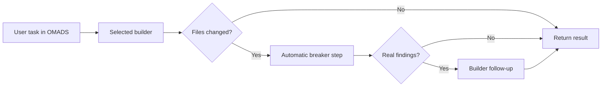

# OMADS — Orchestrated Multi-Agent Development System

OMADS is a local web workspace for people who want one coding agent to build and a second agent to challenge the result before they trust it.

- Choose **Claude Code** or **Codex** as the primary builder
- Run an automatic **builder -> breaker** loop after code changes
- Trigger a separate **manual three-step review** when you want a deliberate audit
- Keep chat history, live logs, and Git diff inspection in one local UI

> No API keys required. OMADS reuses the Claude Code and Codex CLIs you already use locally.

  


A short tour of the current OMADS interface: workspace, project settings, manual review configuration, review dialog, and built-in diff viewer.

## Why People Use OMADS

- You already use Claude Code or Codex locally and want a GUI instead of juggling terminals.
- You want a second opinion before accepting AI-generated code changes.
- You want builder output, review output, logs, and Git diff context to stay visible in one place.
- You want to switch builders without losing the recent task context.

## What Makes OMADS Useful

- **Selectable builder**: Claude Code or Codex can be the primary agent for normal chat tasks.
- **Automatic breaker loop**: when the builder changes code, OMADS can hand the diff to the other agent for a challenge pass.
- **Manual review mode**: run a separate three-step review pipeline when you want a more deliberate inspection.
- **Local-first workflow**: works with your existing CLI subscriptions and stays on your machine.
- **Multi-project workspace**: switch between local repos, inspect diffs, and keep project timelines separate.

## Current Status

OMADS is actively evolving toward a broader public release.

- The core local builder and review workflows are already usable.
- The GitHub integration is currently being rebuilt around OAuth Device Flow and may still change.
- Documentation and release polish are still ongoing.

## How The Main Loop Works



The **Review** button is separate from this normal coding loop. Use it when you want a deliberate manual review of the whole project, the last task, or a custom file selection.

## Quick Start

OMADS needs:

- Python 3.11+
- Node.js
- at least one authenticated CLI: `claude` or `codex`

Linux or macOS:

```bash
git clone https://github.com/dardan3388/omads.git
cd omads
./start-omads.sh
```

Windows PowerShell:

```powershell
git clone https://github.com/dardan3388/omads.git
cd omads
.\start-omads.ps1
```

Then open `http://localhost:8080`.

Best experience: install and authenticate **both** CLIs so OMADS can use cross-agent review and builder switching without feature gaps.

Full setup, Docker usage, first-launch notes, and troubleshooting live in [docs/getting-started.md](docs/getting-started.md).

## See It In Action


This short demo shows a real OMADS GUI round-trip through the live WebSocket path with Claude Code as the selected builder. The full procedure and capture notes live in [docs/live-smoke-tests.md](docs/live-smoke-tests.md).

## Example Tasks

These are the kinds of tasks OMADS is designed to handle well:

```text
Trace the checkout websocket flow, fix any reconnect-state issues, and keep the existing review loop intact.
```

```text
Split the billing logic into smaller modules, keep the current API behavior stable, and add regression tests for the changed paths.
```

```text
Review only src/omads/gui/runtime.py and src/omads/gui/websocket.py. Focus on race conditions, reload safety, and whether findings are routed back to the active builder correctly.
```

## Documentation

- [Getting Started](docs/getting-started.md)
- [Architecture](docs/architecture.md)
- [Live Smoke Tests](docs/live-smoke-tests.md)
- [Changelog](CHANGELOG.md)
- [Contributing](CONTRIBUTING.md)

## Help

- Questions, bugs, or release feedback: [GitHub Issues](https://github.com/dardan3388/omads/issues)
- Contributor workflow and validation expectations: [CONTRIBUTING.md](CONTRIBUTING.md)
- Architectural boundaries and module ownership: [docs/architecture.md](docs/architecture.md)

## License

MIT
